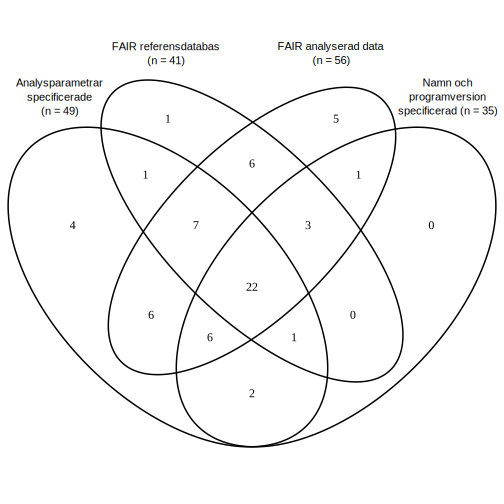

## Figure X - Number of nucleotide sequences in GenBank over time


Numbers were obtained from [NCBI](https://www.ncbi.nlm.nih.gov/genbank/statistics/) on September 1st 2022, and saved as `GenBank_Stats.tsv`.  
For comprehension by ggplot2, dates were reformatted in bash:

```
cat GenBank_Stats.tsv | \
	sed 's/Dec \(....\)/\1-12-01/g' | \
	sed 's/Nov \(....\)/\1-11-01/g' | \
	sed 's/Oct \(....\)/\1-10-01/g' | \
	sed 's/Sep \(....\)/\1-09-01/g' | \
	sed 's/Aug \(....\)/\1-08-01/g' | \
	sed 's/Jul \(....\)/\1-07-01/g' | \
	sed 's/Jun \(....\)/\1-06-01/g' | \
	sed 's/May \(....\)/\1-05-01/g' | \
	sed 's/Apr \(....\)/\1-04-01/g' | \
	sed 's/Mar \(....\)/\1-03-01/g' | \
	sed 's/Feb \(....\)/\1-02-01/g' | \
	sed 's/Jan \(....\)/\1-01-01/g' > GenBank_Stats.v2.tsv
```

The graph was then plotted using [`PlotGenBank.R`](PlotGenBank.R)

## Figure Y - Number of papers fitting the four selection criteria


