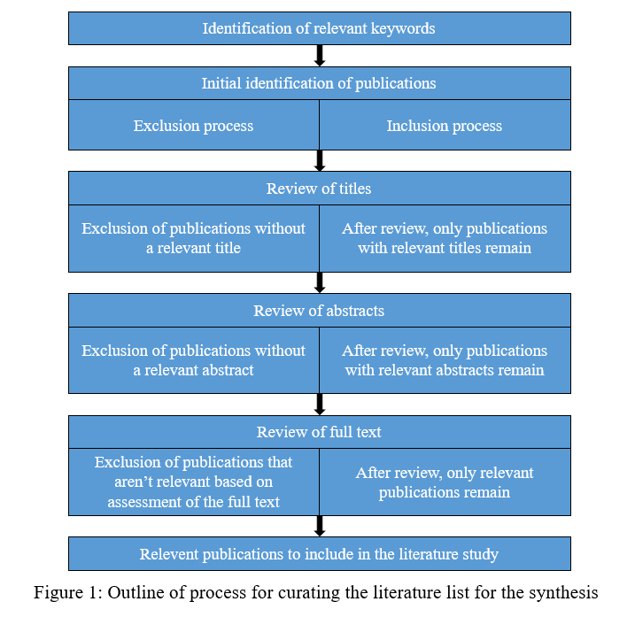

# Reproducible-analysis-of-eDNA-for-national-biodiversity-monitoring-programs

## Abstract
Environmental monitoring is an essential part of safeguarding the sustainable use of natural resources. Current methods for identification and monitoring of biodiversity, especially analysis of microorganisms, involve time-consuming and expensive microscopy analyses performed by specialists, and are frequently a bottleneck in the analysis chain from sampling to data analysis and environmental status evaluation. Consequently, many environments cannot be monitored with the temporal and spatial resolution desired.

Environmental DNA (eDNA) analysis has proven to be a powerful tool for biodiversity assessment and identification of a broad range of organism groups in a variety of different environments. Technological advances in DNA sequencing technology have made eDNA methods viable for analysis of biological diversity on a large scale. However, for this emerging technology to reach its full potential, issues concerning reproducibility of the results, as well as comparability of results over time, need to be addressed.

Many of the problems faced by biodiversity researchers using computational methods and big data are similar to problems identified in other areas, such as software development and cloud computing. To that end, this project will compile a synthesis of literature that describes the technological solutions available for performing reproducible identification and monitoring of biodiversity, using eDNA technology.

A reproducible approach to analysing this type of data will enable data sources of different origin and quality to be combined and analysed together, even as new technologies develop, thereby enabling comparison of results across for example long time series suitable for national monitoring programs. Through this synthesis we will identify reproducibility problems faced in eDNA analyses, highlight how these problems are currently being handled, and discuss the potential for knowledge transfer from adjacent fields using big data.

### Metadata
Location on Albiorix: /proj/data25/Reproducible-analysis-of-eDNA-for-national-biodiversity-monitoring-programs
Required modules: Anaconda3/v2021.11
